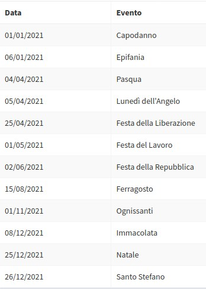

# WorkdayHelper
Count workdays and list holiday events in a range of dates with PHP taking care of public holidays and other custom closing days.

Inspired by Massimo Simonini getWorkdays() Gist.
@see     https://gist.github.com/massiws/9593008

Benefits and features:
- you can specify a range of working days in a week (from monday to sunday);
- you can add custom holidays and business closures, for example as a result of a database query;
- it returns a calendar of holidays for that specific range of dates;
- you can use your custom recursive holiday calendar (see `$publicHolidays`);
- it takes care of the timezone of your application;
- it automatically calculates Easter, and Easter mondays taking care of the timezone (requires PHP with `ext-calendar`);

## Requirements

PHP 5.6.0 and later

## Composer

The preferred way to install this extension is through [composer](http://getcomposer.org/download/).

Either run

```composer require --prefer-dist letsjump/workday-helper-php```


or add


```"letsjump/workday-helper-php": "~1.0.0"```

to the `require` section of your composer.json.

## Manual Installation

If you do not wish to use Composer, you can download the [latest release](https://github.com/letsjump/workday-helper-php).

```php
require_once('/path/to/workday-helper-php/WorkdayHelper.php');
```

## Dependencies

### PHP ext-calendar

To automatically calculate Easter dates, you have to compile PHP with `--enable-calendar`. See [ext-calendar](https://www.php.net/manual/en/book.calendar.php). You can refer to [this Stack Overflow question](https://stackoverflow.com/questions/5297894/fatal-error-call-to-undefined-function-easter-date/51609625) if you are in a Docker environment.

If your PHP isn't compiled with ext-calendar and if you cannot compile it, please set `$calculateEaster` to `false` otherwhise WorkingdayHelper will throw an exception.

 ## Usage:

1. Count the days worked in January while working from Monday to Friday, taking care of public holidays:
```php
use letsjump\workdayHelper\WorkdayHelper;

$closingDays                 = new WorkdayHelper('2021-01-01', '2021-01-31');
$closingDays->workingDays    = [1, 2, 3, 4, 5];

echo $closingDays->getWorkdays(); // (19 days)
```

2. count the day worked in april while working Monday, Wednesday and Friday, taking care of public holidays:

```php
$closingDays                 = new WorkdayHelper('2021-04-01', '2021-04-30');
$closingDays->workingDays    = [1, 3, 5];
echo $closingDays->getWorkdays(); // (12 days)
```

3. Add a strike to the custom closing days

```php
$closingDays                 = new WorkdayHelper('2021-01-01', '2021-01-31');
$closingDays->workingDays          = [1, 2, 3, 4, 5];
$closingDays->customClosing = [
     [
         'date'    => '2021-01-18',
         'event'   => 'Strike!',
         'options' => [
             'employee_id'        => 345,
             'htmlClass' => 'deep-purple'
         ]
     ],
];
echo $closingDays->getWorkdays(); // (18 days)
```

4. Get the calendar with all the closing days for a specific date interval

```php
$closingDays                 = new WorkdayHelper('2021-01-01', '2021-12-31');
$closingDays->workingDays          = [0, 1, 2, 3, 4, 5, 6]; // don't forget to set every day of the week!

<table>
<?php foreach ($closingDays->getCalendar() as $holiday): ?>
<tr>
     <td><?= $holiday['date'] ?></td>
     <td><?= $holiday['event'] ?></td>
</tr>
<?php endforeach ?>
</table>
```



### Add custom closings

Custom closure is an array of events. Each event is an array with this configuration:

key | value | mandatory
----|-------|----------
date| date in Y-m-d format | yes
event | a string representing the name of the closing | yes
options | a string or an array passed as is to the holiday calendar. It may contain information such as event_id, user_id, html attributes, etc.. Please remember that data are passed as they are so, to prevent malicious injection attacks, consider the use of a string purifier function | no

__example__

```php

$myInstantatedClass->customClosing = [
         [
             'date'  => '2021-01-10',
             'event' => 'Chiusura per ferie'
         ],
         [
             'date'    => '2021-01-05',
             'event'   => 'Strike!',
             'options' => [
                  'id'        => 345,
                  'htmlClass' => 'green'
             ]
         ],
          ...
];
```

### Replace the default recursive holiday calendar

The default recursive holiday calendar is an array of events. Each event is an array with this configuration:

key | value | mandatory
----|-------|----------
m-d | the date must be in m-d format | yes
event | a string representing the name of the holiday | yes
options | a string or an array passed as is to the holiday calendar. It may contain information such as event_id, user_id, html attributes, etc.. Please remember that data are passed as they are so, to prevent malicious injection attacks, consider the use of a string purifier function | no

__example__

```php

$myInstantatedClass->publicHolidays = [
         [
             'm-d'  => '12-25',
             'event' => 'Christmas'
         ],
         [
             'm-d'    => '12-26',
             'event'   => 'Boxing day',
             'options' => [
                  'id'        => 345,
                  'htmlClass' => 'green'
             ]
         ],
          ...
];
```

### Holiday calendar
The holiday calendar returns a list of holidays for the working days in the given date range.
So if you want to retrive _all the closing days_ in that date range you should set all the days of the week into the $workingDays Array E.G. $myWorkDay->workingDays[0,1,2,3,4,5,6].

The output is an array of events. Each array has the unix timestamp of the holiday as key and contains:

key | value
----|------
unixTimestamp | the unix timestamp of the event
date | the readable date of the event (you can format it with the parameter `$outputFormat`
event | the name of the event type | `public` or `custom` depending if it is a publicHoliday or a customClosing.
options | a string or an array of user custom options

Example

```php
      [
         [1609455600] => [
             [unixTimestamp] => 1609455600,
             [date] => 2021-01-01, # control the format with $outputFormat property
             [event] => Capodanno, # description of the event
             [type] => public, #public / custom
             [options] => # custom option passed by the $customClosing or the $publicHolidays Array
         ],
         ...
      ]
```

## Side notes

The recursive holiday and the default date format are localized for Italy. I know it's not the right way to work, but I need to quickly develop an application for a customer. If you want to use your localization, please refer to *Replace the default recursive holiday calendar*. If you plan to use intensively in your application, you may extend the base class and configure there the basic properties.

Please report any bug or whishes into the apposite [issue tracker](https://github.com/letsjump/workday-helper-php/issues)